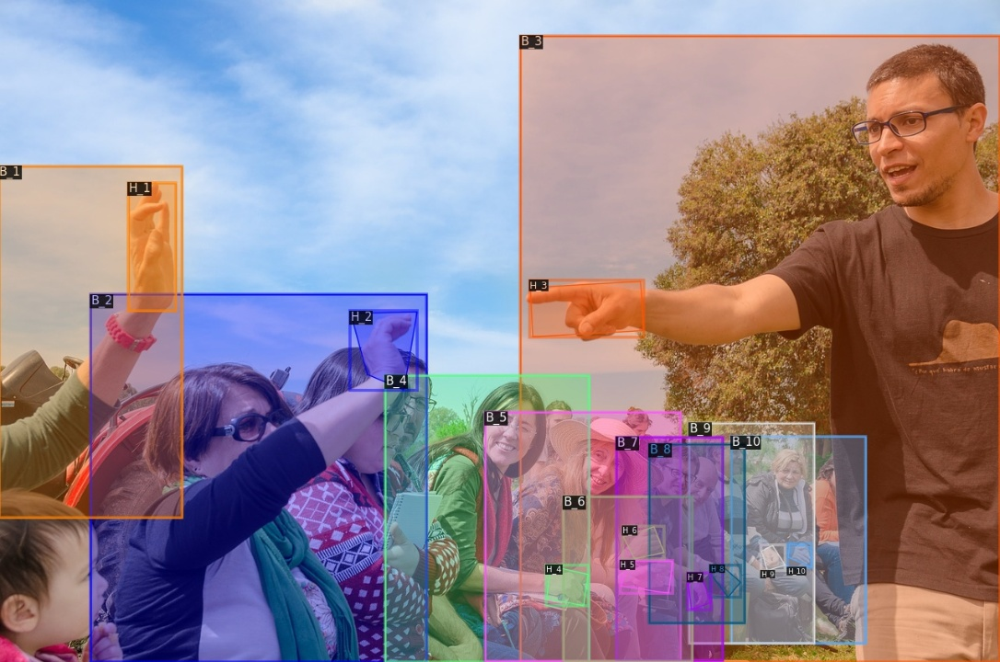

# BodyHands

This repository contains the code and data for the following paper:

[Whose Hands Are These? Hand Detection and Hand-Body Association in the Wild
](https://www3.cs.stonybrook.edu/~sunarasimhas/webpage/BodyHands.pdf) (CVPR 2022)

<p align="center">
    <figure>
        
            <figcaption> We develop a method to detect hands and their corresponding body locations. Hands and bodies belonging to the      same person have bounding boxes in the same color and identification numbers </figcaption>
     </figure>
</p>


## Installation

Follow the installation instructions in [INSTALL.md](INSTALL.md). 

## Project Page and Data

Please see the [project page
](http://vision.cs.stonybrook.edu/~supreeth/BodyHands/) for the required dataset and annotation format.

## Models

Download [models](https://drive.google.com/drive/folders/1HT0dkeDXuewpcZTEAFYIy4i2Zut28xJ0?usp=sharing) and place them in ```./models/```.

## Training

Use the following command for training:

`python train_net.py --config-file configs/BodyHands.yaml`

## Evaluation

Use the following command for evaluation:

`python train_net.py --config-file configs/BodyHands.yaml --eval-only MODEL.WEIGHTS <path to model weights>`

## Demo: Run hand detection and hand-body association on custom images 

Use the following command to detect hands and their corresponding person locations:

`python demo.py --input <path to a directory containing images> --thresh 0.7`

Use the parameter ```thresh``` to vary the precision and recall of detections.

The output images with hand detections and corresponding body locations' visualizations will be stored in `./demoOutput/`. 

## Citation
If you find our code or dataset useful, please cite our work using the following:

```
@inproceedings{bodyhands_2022,
    title={Whose Hands Are These? Hand Detection and Hand-Body Association in the Wild},
    author={Supreeth Narasimhaswamy and Thanh Nguyen and Mingzhen Huang and Minh Hoai},
    booktitle={Proceedings of the IEEE/CVF Conference on Computer Vision and Pattern Recognition (CVPR)},
    year={2022},
}
            
@inproceedings{handler_2022,
    title={Forward Propagation, Backward Regression and Pose Association for Hand Tracking in the Wild},
    author={Mingzhen Huang and Supreeth Narasimhaswamy and Saif Vazir and Haibin Ling and Minh Hoai},
    booktitle={Proceedings of the IEEE/CVF Conference on Computer Vision and Pattern Recognition (CVPR)},
    year={2022},
}

@inproceedings{contacthands_2020,
    title={Detecting Hands and Recognizing Physical Contact in the Wild},
    author={Supreeth Narasimhaswamy and Trung Nguyen and Minh Hoai},
    booktitle={Advances in Neural Information Processing Systems (NeurIPS)},
    year={2020},
}
```
